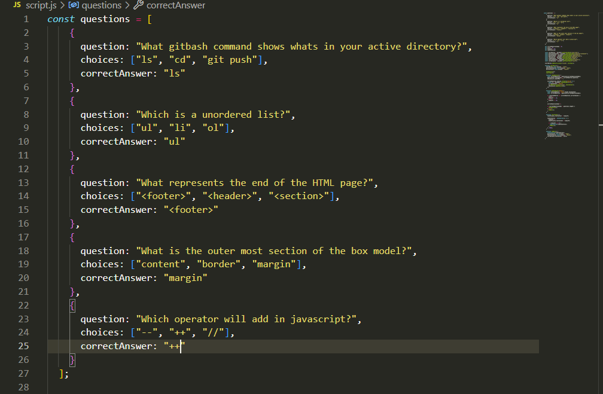
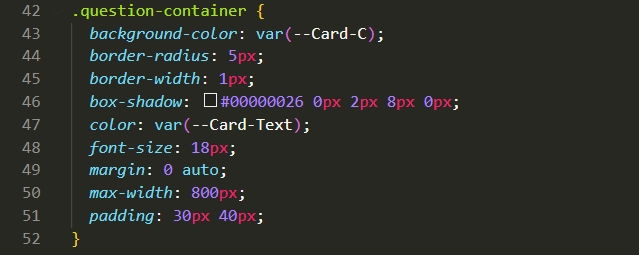
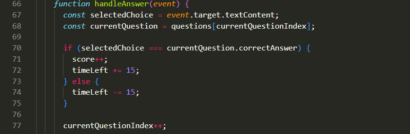

# Challenge-4

## Website link

## Instructions
1. Press start
2. Answer each question in the given time

## Description

A short 5 question quiz over coding topics, 55 seconds is given to answer each question. Whether or not the user answers the questions correctly will either deduct or add 15 seconds to their time.

- "what was my motivation?" To build a quick and easy quiz application.
- "why did I build this project?" To learn how to create a quiz and timer functions.
- "what problem does it solve?" Gives user a simple and easy foundation change the applications questions to their liking.
- "what did I learn?" How to create a timer, and a multiple choice quiz application.

## Features

- Timer
- Buttons

## Screenshots

## Installation

--------------

## Usage

Simple short quiz applications. 

## Credits

    Refactored code from "challenge-3?
    Reused "challenge-3" README as a template.
    "https://dev.to/sulaimonolaniran/building-a-simple-quiz-with-html-css-and-javascript-4elp"
    "https://dev.to/walternascimentobarroso/creating-a-timer-with-javascript-8b7"

## License 

MIT License

Copyright (c) [2023] [Locket Layne]

Permission is hereby granted, free of charge, to any person obtaining a copy
of this software and associated documentation files (the "Software"), to deal
in the Software without restriction, including without limitation the rights
to use, copy, modify, merge, publish, distribute, sublicense, and/or sell
copies of the Software, and to permit persons to whom the Software is
furnished to do so, subject to the following conditions:

The above copyright notice and this permission notice shall be included in all
copies or substantial portions of the Software.

THE SOFTWARE IS PROVIDED "AS IS", WITHOUT WARRANTY OF ANY KIND, EXPRESS OR
IMPLIED, INCLUDING BUT NOT LIMITED TO THE WARRANTIES OF MERCHANTABILITY,
FITNESS FOR A PARTICULAR PURPOSE AND NONINFRINGEMENT. IN NO EVENT SHALL THE
AUTHORS OR COPYRIGHT HOLDERS BE LIABLE FOR ANY CLAIM, DAMAGES OR OTHER
LIABILITY, WHETHER IN AN ACTION OF CONTRACT, TORT OR OTHERWISE, ARISING FROM,
OUT OF OR IN CONNECTION WITH THE SOFTWARE OR THE USE OR OTHER DEALINGS IN THE
SOFTWARE.